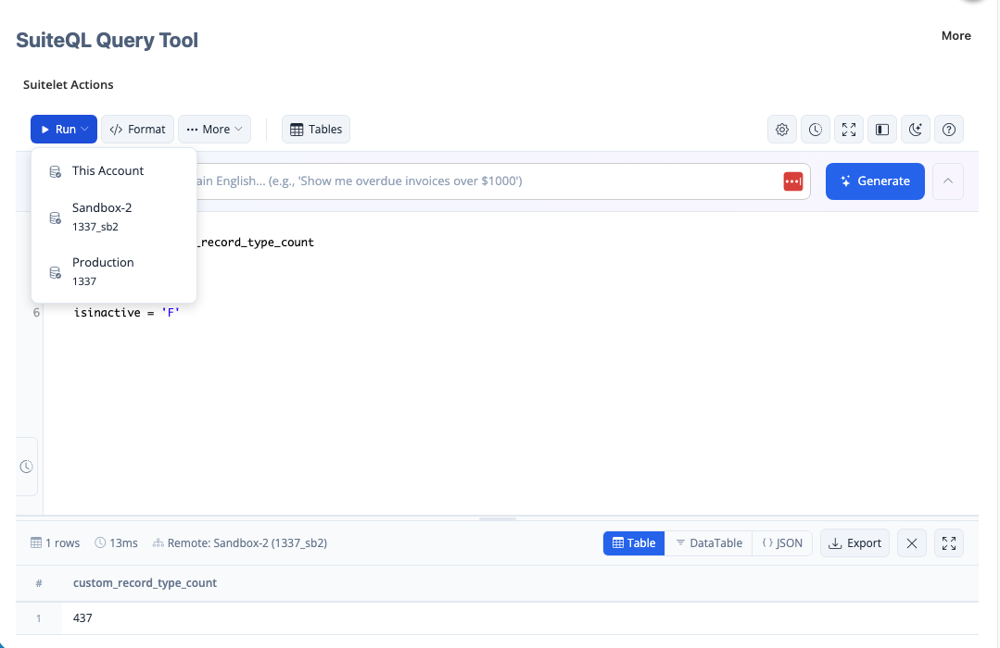
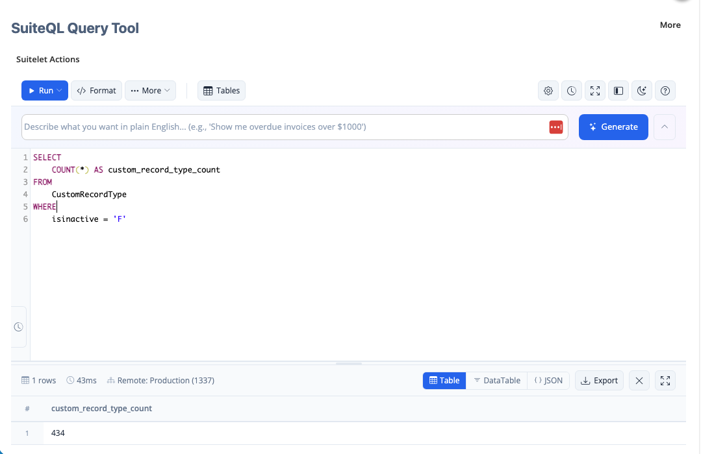
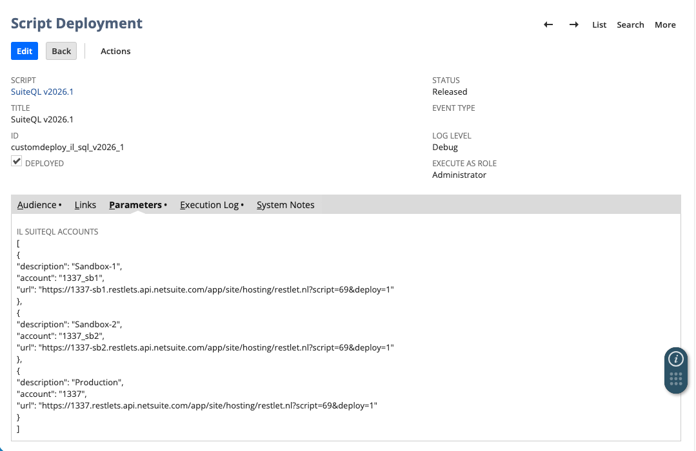

# Multi-Account SuiteQL Execution (Custom Extension)

This repository contains a customized extension of **Tim Dietrich’s SuiteQL Query Tool** that adds **multi-account remote execution** with explicit **execution context awareness**.

The goal of this extension is to make it **safe, obvious, and intentional** to run the same SuiteQL query across multiple NetSuite environments without ambiguity about where the data originated.

---

## What This Feature Adds

### 1. Multi-Account Remote Execution

Queries can be executed against:

- the **current NetSuite account** (local execution), or
- **one or more remote NetSuite accounts** configured via script parameters.

A single, unified execution path is used for both local and remote runs, ensuring consistent behavior regardless of how the query is triggered (toolbar, dropdown, keyboard shortcut, validation flow, or history replay).

Remote accounts are defined centrally using a script parameter and are not hard-coded into the client.

### Account Selection (Run Dropdown)

The Run button exposes a dropdown allowing explicit selection of the
execution target (local or remote account).


---

### 2. Explicit Execution Context in Results

Every query result includes a **persistent execution context indicator** in the results metadata row.

Examples:

- `Local: Sandbox-1 (1337_SB1)`
- `Remote: Sandbox-2 (1337_SB2)`
- `Remote: Production (1337)`

This indicator:

- makes the execution origin immediately visible
- persists across view changes (Table / DataTable / JSON)
- remains visible when results are maximized
- survives history reloads and keyboard-triggered executions

This eliminates a common and dangerous failure mode in multi-account tooling: **assuming data came from the wrong environment**.


### Remote Execution – Production Account

When a query is executed against a remote account, the execution context
is displayed directly in the results metadata.



### Remote Execution – Sandbox Account

The same query executed against a different remote environment clearly
indicates the change in execution origin.


---

### 3. Centralized Account Resolution

Remote account metadata (description, account ID, execution URL) is:

- resolved server-side
- injected once at page load
- treated as immutable client-side configuration

Execution functions receive only an **execution identity** (remote URL), and all presentation metadata is resolved centrally.

---

## Configuration

### Suitelet Deployment Parameter

After deploying the SuiteQL Query Tool Suitelet, configure the following **script parameter** on the *deployment record*:

**Parameter name**
```
custscript_il_suiteql_accounts
```

**Parameter type**
```
Long Text
```

**Expected value**  
A JSON array describing the remote NetSuite accounts that queries may be executed against.

Example:

```json
[
  {
    "description": "Sandbox-1",
    "account": "1337_sb1",
    "url": "https://1337-sb1.restlets.api.netsuite.com/app/site/hosting/restlet.nl?script=69&deploy=1"
  },
  {
    "description": "Sandbox-2",
    "account": "1337_sb2",
    "url": "https://1337-sb2.restlets.api.netsuite.com/app/site/hosting/restlet.nl?script=69&deploy=1"
  },
  {
    "description": "Production",
    "account": "1337",
    "url": "https://1337.restlets.api.netsuite.com/app/site/hosting/restlet.nl?script=69&deploy=1"
  }
]
```

This parameter is parsed server-side and injected into the client application at page load.

#### Script Deployment Example

The following screenshot shows the Suitelet deployment record with the  
`custscript_il_suiteql_accounts` parameter populated.


---

### OAuth & Integration Setup

Remote execution requires a standard NetSuite **Integration Record** and associated **OAuth 1.0 access tokens** in each remote account.

Required components:

- Integration Record with Token-Based Authentication enabled
- OAuth role with appropriate permissions (SuiteAnalytics, record-level access, RESTlets)
- Access Token generated for that role

---

### Credential Storage (`secret.js`)

OAuth credentials are stored in a dedicated `secret.js` file.

> **Important Disclaimer**
>
> NetSuite’s OAuth 1.0 signing process requires access to the **raw credential values** at runtime to generate valid request signatures.
>
> At the time of writing, NetSuite’s API Secrets or credential vault mechanisms do **not** provide a supported way to retrieve OAuth credentials in a form suitable for OAuth request signing.
>
> As a result, credentials must be supplied directly to the signing logic.

For this reason:

- `secret.js` **must not** be committed to source control
- credentials should be environment-specific
- access to the file should be tightly restricted

---

## Attribution

- Original SuiteQL Query Tool: **Tim Dietrich**
- Multi-account remote execution feature and execution context enhancements: **Budy**

---

## Summary

This customization extends the SuiteQL Query Tool with:

- safe multi-account execution
- explicit Local vs Remote execution context
- centralized, immutable account configuration

The result is a more transparent, safer, and more trustworthy experience when working across multiple NetSuite environments.
